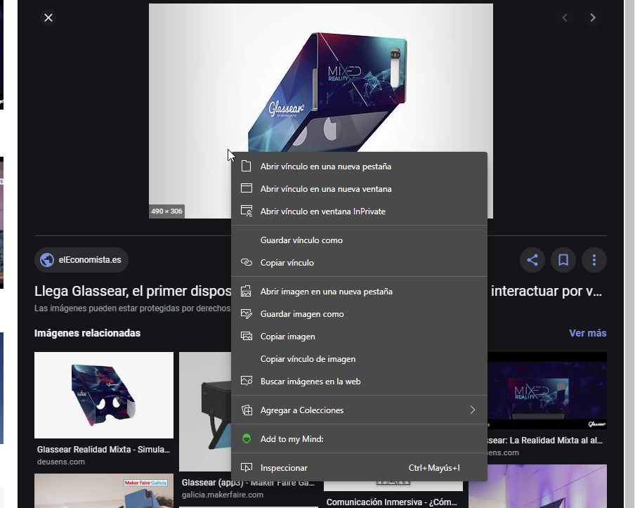

# NotionAI MyMind


This repo uses AI and the wonderful Notion to enable you to add anything on the web to your "Mind" and forget about everything else.


### Project Philosophy.

The idea is to have an extension on the browser, and app on android and Ios, allowing you to add whatever you find on the web in your "Mind".
Also, adding image and article tagging capabilities thanks to AI, so you can simply search on your "Mind" for what you remember.

Right now, there's a working but work in progress Python Local Server, that receives all the data from the extension and the app, and publishes it to Notion. So it is 100% open source and fully private!

https://chrome.google.com/webstore/detail/notion-ai-my-mind/eaheecglpekjjlegffodbfhbhdmnjaph?hl=es&authuser=0 the chromium browsers such as google chrome or microsoft edge can install the extension from the store!

## Adding text to your mind


## Adding images to your mind


# Obtaining Credentials

Right now there is no official way of accessing the Notion API but there is a little work-around to get your credentials.

## Prerequisites

You need to have an account on [Notion.so](https://notion.so/) and need to be logged in.

## Getting your credentials

Most of the modern web browsers support inspecting cookies visually using the browser's devtools.
You can read how to do it in your browser here:

- [Chrome](https://developers.google.com/web/tools/chrome-devtools/manage-data/cookies)
- [Firefox](https://developer.mozilla.org/en-US/docs/Tools/Storage_Inspector)

After you found the Notion.so cookie, look for an entry called `token_v2`. It is the necessary credential for the Python server. 

For AI Tagging you need to create a free account at [Clarifai](https://www.clarifai.com/) and create an Application named whatever you want and get the API key.


### Love to try it?

- Step 1. Simply clone this repo.
```
git clone https://github.com/elblogbruno/NotionAI-MyMind
```
- Step 2. Install requirements for python server.
```
cd NotionAI-MyMind && pip -r install requirements.txt
```
- Step 3. Run the server.
```
python server.py \\Python 3.5 or up needed.
```
- Step 4. Create Notion Database.
It must have this properties selected and add more properties if you want, but the selected ones must exist. 


- Step 5. Go to your servers IP and fill the data needed (Token, Notion Database URL and clarifai api key).


- Step 6. Load the extension on your chromium Browser or install it from the 


- Step 7. Change the config of your extension to your local server IP.


- Step 8. ENJOY!


# TODO
- Finish flutter Android and Ios app
- Fix extension issues
- Develop extension for Firefox
- Develop the AI tagging part.

