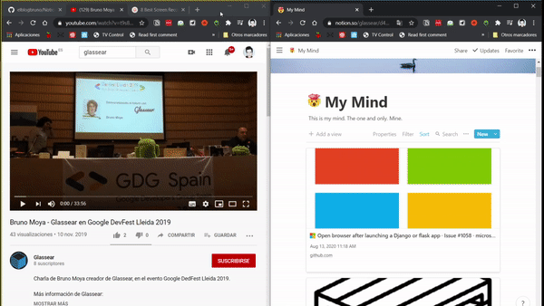
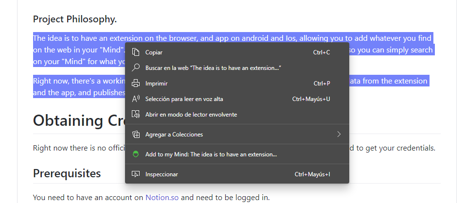

# NotionAI MyMind


This repo uses AI and the wonderful Notion to enable you to add anything on the web to your "Mind" and forget about everything else.

## Table of Contents
- [Project Philosophy](#project-philosophy)
    - [Examples](#examples)
- [Installing](#installing)
    - [Prerequisites](#prerequisites)
    - [Love to try it?](#love-to-try-it)
- [Common Issues](#common-issues)
- [Roadmap](#roadmap)

## Project Philosophy.

The idea is to have an extension on the browser, and app on android and Ios, allowing you to add whatever you find on the web in your "Mind".
Also, adding image and article tagging capabilities thanks to AI, so you can simply search on your "Mind" for what you remember.

Right now, there's a working but work in progress Python Local Server, that receives all the data from the extension and the app, and publishes it to Notion. So it is 100% open source and fully private!

### Chromium users
https://chrome.google.com/webstore/detail/notion-ai-my-mind/eaheecglpekjjlegffodbfhbhdmnjaph?hl=es&authuser=0 the chromium browsers such as google chrome or microsoft edge can install the extension from the store!
### Firefox users
https://addons.mozilla.org/es/firefox/addon/notion-ai-my-mind/ firefox users can install the extension from the store!

## Examples.

Adding text to your mind         |  Adding images to your mind
:-------------------------:|:-------------------------:
  |  


## Installing

### Prerequisites

Right now there is no official way of accessing the Notion API but there is a little work-around to get your credentials.
You need to have an account on [Notion.so](https://notion.so/) and need to be logged in your browser.

### Getting your credentials

On to the chrome extension settings, you can get your needed token_v2! It is necessary for the Python server. (Hidden in the photo for obvious reasons)         |  For AI Tagging you need to create a free account at [Clarifai](https://www.clarifai.com/) and create an Application named whatever you want and get the API key.
:-------------------------:|:-------------------------:
  |  


### Love to try it?

To install the python server, fire up your linux distributed machine and run this command.
```
wget https://raw.githubusercontent.com/elblogbruno/NotionAI-MyMind/master/setup.sh && sudo sh setup.sh
```
That's it.

The installation script will:
- Download the repo and install the server, then follow steps 4 to 7 down here:

Instead, you can follow the steps down here:

- Step 1. Simply clone this repo.
```
git clone https://github.com/elblogbruno/NotionAI-MyMind
```
- Step 2. Install requirements for python server.
```
cd NotionAI-MyMind && pip -r install requirements.txt
```
- Step 3. Run the server.
```
python server.py \\Python 3.5 or up needed.
```
- Step 4. Create Notion Database.
It must have this properties selected and add more properties if you want, but the selected ones must exist. 


- Step 5. Go to your servers IP and fill the data needed (Token, Notion Database URL and clarifai api key).


- Step 6. Load the extension on your chromium Browser or install it from the https://chrome.google.com/webstore/detail/notion-ai-mymind/eaheecglpekjjlegffodbfhbhdmnjaph?hl=es&authuser=0 Chrome web store.


- Step 7. Change the config of your extension to your local server IP.


- Step 8. ENJOY!

## Roadmap
- You can check the roadmap here: https://github.com/elblogbruno/NotionAI-MyMind/projects/1
